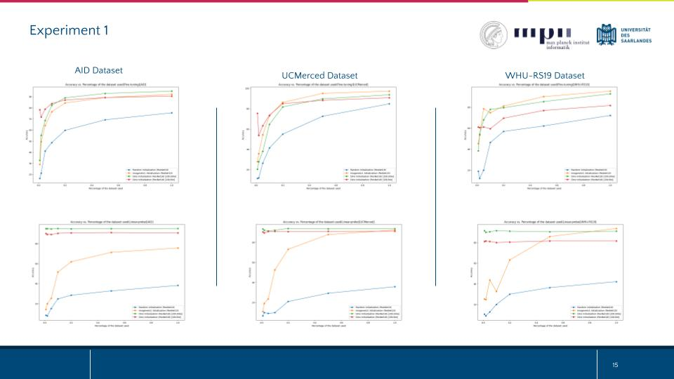
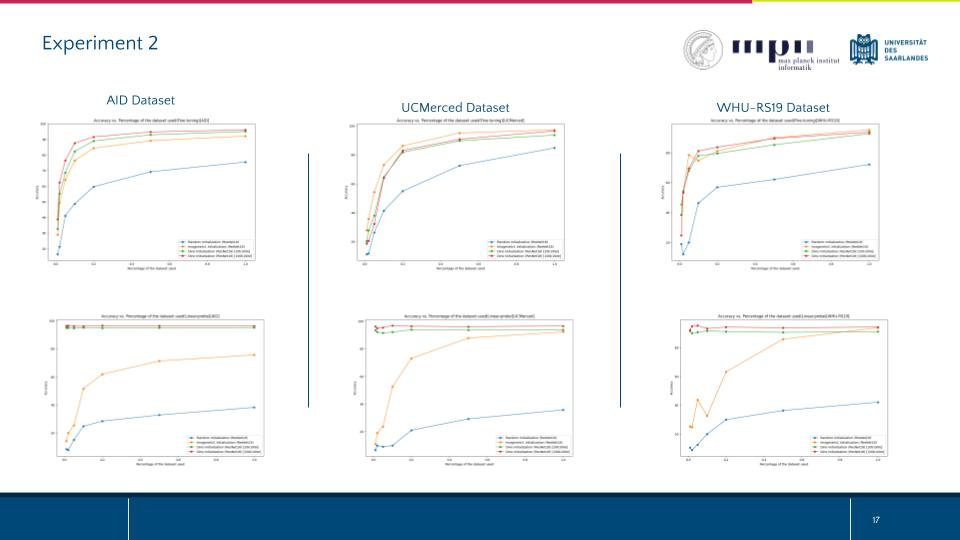
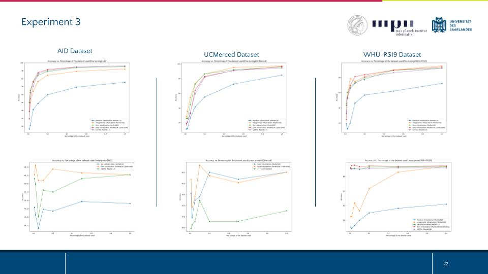

# Self-Supervision in Time for Satellite Images (S3-TSS)

[![Contributors][contributors-shield]][contributors-url]
[![Forks][forks-shield]][forks-url]
[![Stargazers][stars-shield]][stars-url]
[![Issues][issues-shield]][issues-url]
<!-- [![MIT License][license-shield]][license-url] -->
<!-- [![LinkedIn][linkedin-shield]][linkedin-url] -->


<!-- PROJECT LOGO -->
<br />
<div align="center">
  <a href=https://github.com/akansh12/">
    
  </a>

  <h3 align="center">Self-Supervision in time for Satellite Images(S3-TSS) A novel method of SSL technique in Satellite images</h3>

  <p align="center">
    Team 18, High-level Computer Vision 2023 by Bernt Schiele
    <br>
    <a href="https://docs.google.com/presentation/d/1xqHzMUt9Eb7YKVuEHwWn2mVgw7fXXXNnzxvrWLtKa0g/edit?usp=sharing">Presentation</a>
    .
    <a href="/report/HLCV_Project_team_18.pdf">Report</a>
    .
    <a href = "https://arxiv.org/abs/2403.04859"> Arxiv paper</a>
  </p>
</div>

<!-- TABLE OF CONTENTS -->
<details>
  <summary>Table of Contents</summary>
  <ol>
    <li>
      <a href="#about-the-project">About The Project</a>
    </li>
    <li><a href="#folder-structure">Folder structure</a></li>
    <li><a href="#results-on-other-datasets">Results on other datasets</a></li>
    <li><a href="#team-memebers">Team Members</a></li>
    <li><a href="#acknowledgments">Acknowledgments</a></li>
    <li><a href="#paper-and-citation">Paper and Citation</a></li>
    <li><a href="#contact">Contact</a></li>

  </ol>
</details>


## About The Project


With the limited availability of labeled data with various atmospheric conditions in remote sensing images, it seems useful to work with self-supervised algorithms. Few pretext based algorithms including from rotation, spatial context and jigsaw puzzles are not appropriate for satellite images \cite{wang2022selfsupervised}. Often, satellite images have a higher temporal frequency. So, the temporal dimension of remote sensing data provides natural augmentation without requiring us to create artificial augmentation of images. Here, we propose S3-TSS, a novel method of self-supervised learning technique that leverages natural augmentation occurring in temporal dimension. We compare our results with current state-of-the-art methods and also perform various experiments. We observed that our method was able to perform better than baseline SeCo \cite{seco} in four downstream datasets. Code for our work can be found [here](https://github.com/hewanshrestha/Why-Self-Supervision-in-Time}{https://github.com/hewanshrestha/Why-Self-Supervision-in-Time)

## Folder structure
- All the code can be found under notebook/
- The final dataset can be found under data/processed/all_city_data_with_pop.csv
```
├── data
│   └── assets
├── Dockerfile
├── figures
├── README.md
├── report
│   └── HLCV_Project_team_18.pdf
└── src
    ├── modules
    │   ├── preprocess.py
    │   ├── seco_datamodule.py
    │   ├── seco_dataset.py
    │   ├── seco_dataset_temporal.py
    │   └── seco_utils.py
    ├── notebooks
    │   ├── docker
    │   │   └── exp_1
    │   │       ├── requirements.txt
    │   │       └── resnet18_dino_100k.py
    │   ├── EDA_EuroSAT.ipynb
    │   ├── SECO_EDA.ipynb
    │   ├── SSL_experiment
    │   │   ├── exp_1.ipynb
    │   │   └── exp_2_DINO_temporal.ipynb
    │   ├── SSL_seco.ipynb
    │   └── VIT-classification.ipynb
    └── pipeline
        ├── resnet18_pipeline_eurosat.ipynb
        ├── resnet18_pipeline_eurosat pretrained.ipynb
        ├── resnet18_pipeline_eurosat_SECO.ipynb
        ├── resnet50_pipeline_final.ipynb
        └── resnet50_pipeline.ipynb

```
## Results on other datasets
#### Experiment 1: 
- Architecture: ResNet18
- Dataset: SeCo-20k(out of 100k)
- Epochs: 30 and 100
- Downstream Datasets: Eurosat(In report), AID, UCMerced, WHU-RS19
- Metric: Fine-tuning and Linear-probe

<figure style="text-align:center">
  
</figure>

#### Experiment 2: 
- Architecture: ResNet18
- Dataset: SeCo-100k
- Epochs: 100
- Downstream Datasets: Eurosat(In report), AID, UCMerced, WHU-RS19
- Metric: Fine-tuning and Linear-probe

<figure style="text-align:center">
  
</figure>

#### Experiment 3: 
- Architecture: ResNet18
- Dataset: SeCo-100k
- Self-Supervision in Time (S3-TSS)
- Epochs: 100
- Downstream Datasets: Eurosat(In report), AID, UCMerced, WHU-RS19
- Metric: Fine-tuning and Linear-probe
- Comparison with SeCo baseline

<figure style="text-align:center">
  
</figure>


## Team Members
1. Akansh Maurya (7047939) 
2. Hewan Shrestha (7047533)
3. Mohammad Munem Shahriar (7002640)

<!-- ACKNOWLEDGMENTS -->
## Acknowledgments
We would like to thank Prof. Dr. Bernt Schiele and tutors of HLCV course 2023 at Saarland University for giving us the opportunity to work in this project. 
<!-- Paper and Citation -->
## Paper and Citation
Please use the following citation: 

<!-- Contact -->
## Contact
Email: akanshmaurya@gmail.com


<!-- MARKDOWN LINKS & IMAGES -->
<!-- https://www.markdownguide.org/basic-syntax/#reference-style-links -->
[contributors-shield]: https://img.shields.io/github/contributors/hewanshrestha/Why-Self-Supervision-in-Time
[contributors-url]: https://github.com/hewanshrestha/Why-Self-Supervision-in-Time/graphs/contributors

[forks-shield]: https://img.shields.io/github/forks/hewanshrestha/Why-Self-Supervision-in-Time
[forks-url]: https://github.com/hewanshrestha/Why-Self-Supervision-in-Time/forks

[stars-shield]: https://img.shields.io/github/stars/hewanshrestha/Why-Self-Supervision-in-Time
[stars-url]: https://github.com/akansh12/hewanshrestha/Why-Self-Supervision-in-Time/stargazers

[issues-shield]: https://img.shields.io/github/issues/hewanshrestha/Why-Self-Supervision-in-Time
[issues-url]: https://github.com/hewanshrestha/Why-Self-Supervision-in-Time/issues

<!-- [license-shield]: https://img.shields.io/github/license/othneildrew/Best-README-Template.svg?style=for-the-badge
[license-url]: https://github.com/othneildrew/Best-README-Template/blob/master/LICENSE.txt

[linkedin-shield]: https://img.shields.io/badge/-LinkedIn-black.svg?style=for-the-badge&logo=linkedin&colorB=555
[linkedin-url]: https://linkedin.com/in/othneildrew -->

[product-screenshot]: figures/overview.gif
[data-collect-pipeline]: figures/Data-collection.jpeg
[Next.js]: https://img.shields.io/badge/next.js-000000?style=for-the-badge&logo=nextdotjs&logoColor=white
[Next-url]: https://nextjs.org/
[React.js]: https://img.shields.io/badge/React-20232A?style=for-the-badge&logo=react&logoColor=61DAFB
[React-url]: https://reactjs.org/
[Vue.js]: https://img.shields.io/badge/Vue.js-35495E?style=for-the-badge&logo=vuedotjs&logoColor=4FC08D
[Vue-url]: https://vuejs.org/
[Angular.io]: https://img.shields.io/badge/Angular-DD0031?style=for-the-badge&logo=angular&logoColor=white
[Angular-url]: https://angular.io/
[Svelte.dev]: https://img.shields.io/badge/Svelte-4A4A55?style=for-the-badge&logo=svelte&logoColor=FF3E00
[Svelte-url]: https://svelte.dev/
[Laravel.com]: https://img.shields.io/badge/Laravel-FF2D20?style=for-the-badge&logo=laravel&logoColor=white
[Laravel-url]: https://laravel.com
[Bootstrap.com]: https://img.shields.io/badge/Bootstrap-563D7C?style=for-the-badge&logo=bootstrap&logoColor=white
[Bootstrap-url]: https://getbootstrap.com
[JQuery.com]: https://img.shields.io/badge/jQuery-0769AD?style=for-the-badge&logo=jquery&logoColor=white
[JQuery-url]: https://jquery.com 

To cite our work, please use the following:
```
@misc{maurya2024selfsupervision,
      title={Self-Supervision in Time for Satellite Images(S3-TSS): A novel method of SSL technique in Satellite images}, 
      author={Akansh Maurya and Hewan Shrestha and Mohammad Munem Shahriar},
      year={2024},
      eprint={2403.04859},
      archivePrefix={arXiv},
      primaryClass={cs.AI}
}
``` 


